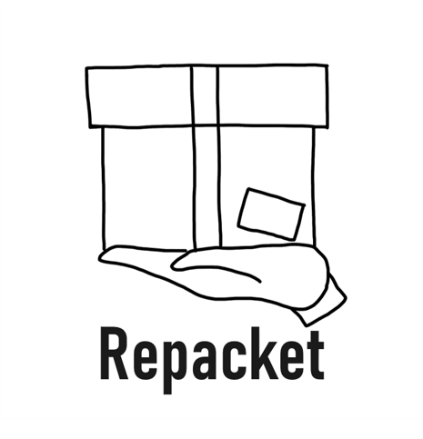

## Repacket
Repacket is a CLI tool to rewrite packets!




### Usage

```
usage: repacket if [expressions] then [expressions]  

```

Repacket can be used as follows.

```
// Please specify if/then expressions.
repacket if udp_dest 443 then udp_dest 50000

// "all" means no filter.
repacket if all then ip_tos 0

// Multiple parameters are welcome.
repacket if tcp_ack on tcp_psh on then tcp_dest 50000

// Impossible combination won't be executed.
// Error!
repacket if tcp_cwr on then udp_check 0xcafe

```

### Parameters
Filtering rules (shown as [expression] in `Usage`) are specified using following parameter.

```
ip_ver
ip_hl
ip_tos
ip_dscp
ip_ecn
ip_tot_len
ip_id
ip_flags
ip_flag_res
ip_flag_df
ip_flag_mf
ip_offset
ip_ttl
ip_protocol
ip_check
ip_src

tcp_src
tcp_dest
tcp_seq
tcp_ack_seq
tcp_hlen
tcp_res
tcp_nonce
tcp_cwr
tcp_ece
tcp_urg
tcp_ack
tcp_psh
tcp_rst
tcp_syn
tcp_fin
tcp_window
tcp_check
tcp_urg_ptr

udp_src
udp_dest
udp_len
udp_check

icmp_type
icmp_code
icmp_check
```

### Installation
TODO


### Respectful Implementation
[facebookincubator/katran](https://github.com/facebookincubator/katran)  
[linux/samples/bpf](https://github.com/torvalds/linux/tree/master/samples/bpf)  
[xdp-project/xdp-tutorial](https://github.com/xdp-project/xdp-tutorial)  
[takehaya/Vinbero](https://github.com/takehaya/Vinbero)  
